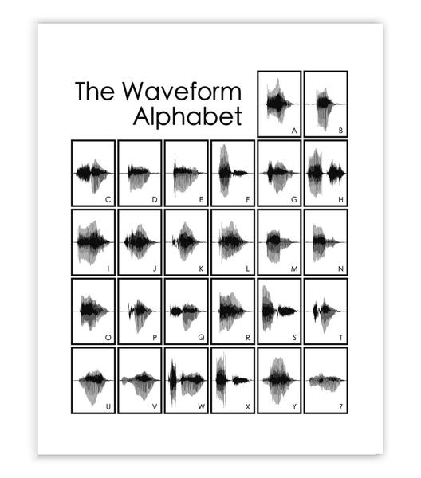

# MEETINGS
1. [September](#sep)
2. [October](#oct)
3. [November](#nov)
4. [December](#dec)

## WK of Sep. 24 

- Met with PHD student Timmy, and Master student Isatou.
- Timmy introduced to us the single point laser, scanning laser, the matLab program 'Display' that he wrote in order to get data from using the single point laser. He also gave us some example data & things to look up, like:
	- FFT, NLP
	- Material for Vibration

## WK of Oct. 1

- In class presentation gave us the idea that if we want to scale our project, to include detecting/determining objects within our space.
- Researched FFT & Vibration Analysis
	- Good intro to Vibration Analysis
		- https://www.imv.co.jp/e/pr/vibration_measuring/chapter03/
	- Detailed Vibration Analysis
		- https://blog.mide.com/vibration-analysis-fft-psd-and-spectrogram
- Decided to start with detecting letters of the alphabet, then numbers, then words.
	- Image of the Waveform Alphabet
		- 
			- Source: https://www.bespokenart.com/products/waveform-alphabet?variant=27061748353

## WK of Oct. 8

- Performed more research:
	- Spectogram
		-http://home.cc.umanitoba.ca/~robh/howto.html#formants
		-http://www.fon.hum.uva.nl/praat/

## WK of Oct. 15

- Working on 1.hea & 2.double blind
- Met with BME student using the LDV

## WK of Oct. 22

- Met with Timmy
- Performed some test data
  - Played a sound coming from a phone that was encased in a metallic container.
  - Performed FFT on the data to see our results.

## WK of Oct. 29

- Working on Spec Report

## WK of Nov. 5 

- Read lots of research papers regarding the LDV and remote voice detection.

## WK of Nov. 12

- Continue to read more research papers on the LDV. 

## WK of Nov. 19

- More research on how to expand project. 
    - Came to conclusion to use TIMIT data for voice recognition. 

## WK of Nov. 26

- Went to perform more experiments with the LDV.
    - Increased range.
    - Utilized voices.

## WK of Dec. 3 

- Working on Design Report

## WK of Dec. 10

- Classes have ended...will resume meetings next semester.

